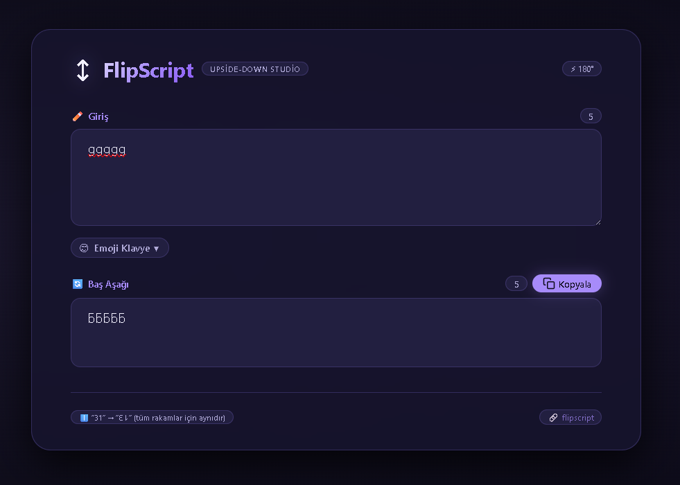

# ↕ FlipScript – Upside-Down Text Studio

**Her karakteri baş aşağı çevir, emojilerle zenginleştir, tek tıkla kopyala.**

FlipScript, metinleri 180 derece döndürerek (upside-down) eğlenceli ve okunaksız (?) hale getiren, aynı zamanda kategorilere ayrılmış bir emoji klavyesi sunan tek sayfalık (SPA) bir web uygulamasıdır. Türkçe, İngilizce, Fransızca, sayılar, noktalama işaretleri ve yüzlerce emoji ile tam uyumludur.



---

## ✨ Özellikler

- **Anlık dönüşüm** – Giriş yaptığınız her karakter baş aşağı çevrilir ve önizleme alanında gösterilir.
- **Akıllı karakter haritası** – Tüm Latin alfabesi (büyük/küçük), Türkçe (`çğşıöü`), Fransızca aksanlı harfler, rakamlar, noktalama işaretleri ve sohbet sembolleri (`\ / @ # $ % ^ & * + = | ~` vb.) desteklenir.
- **Emoji klavye** – `emoji.json` dosyasından okunan emojiler, kategorilerine göre gruplanır. Kategori butonlarıyla geçiş yapabilir, tıklayarak doğrudan metin alanına ekleyebilirsiniz.
- **Çift yönlü karakter sayacı** – Giriş ve çıkış metinlerinin uzunluğu (`String.length`) gerçek zamanlı olarak gösterilir. Emojiler, bayraklar ve ZWJ birleşimleri doğru sayılır.
- **Tek tıkla kopyalama** – Dönüştürülen metin, panoya kopyalanabilir. Kopyalama butonu yalnızca çıktı varsa etkinleşir.
- **Tamamen duyarlı (responsive)** – `clamp()`, esnek grid ve mobil-first yaklaşımıyla tüm cihazlarda (telefon, tablet, masaüstü) kusursuz görünür.
- **Cam efekti (glassmorphism) & koyu tema** – Modern, göz yormayan ve premium bir arayüz.

---

## 📦 Kullanım

1. **Metin girin** – Üstteki text area’ya istediğiniz metni yazın. Baş aşağı dönüşümü otomatik olarak görünecektir.
2. **Emoji ekleyin** – “Emoji Klavye” butonuna tıklayarak açılan klavyeden bir kategori seçin ve istediğiniz emojiye tıklayın. Emoji, imleç konumuna eklenir.
3. **Kopyalayın** – Dönüşmüş metin hazır olduğunda sağ üstteki “Kopyala” butonuna tıklayarak panoya alın.
4. **Karakter sayacını takip edin** – Giriş kutusunun sağ üstünde ve çıkış kutusunun sağ üstünde karakter sayıları canlı olarak güncellenir. 200+ karakterde sarı, 500+ karakterde kırmızı uyarı verir.

---

## 🖥️ Teknik Detaylar

### Dönüşüm Mantığı

Metin ters çevrilirken:

1. Her karakter Unicode karşılığı ile eşleştirilir.
2. Eşleşme yoksa karakter olduğu gibi bırakılır.
3. Tüm metin `reverse()` ile tersten okunur (çünkü baş aşağı yazı sağdan sola okunur).

Örnek: `"31"` → ters çevrilmiş dizi `['1','3']` → haritalama `'1'→'⇂'`, `'3'→'Ɛ'` → `"Ɛ⇂"` (görsel olarak “13” gibi okunur, beklenen davranıştır).

### Emoji Klavye Çalışma Prensibi

- Uygulama başlangıcında `fetch('emoji.json')` ile aynı dizindeki JSON dosyası yüklenir.
- JSON bir dizi olmalı ve her öğe `emoji` ve `category` alanlarını içermelidir (diğer alanlar isteğe bağlı).
- Kategoriler otomatik olarak çıkarılır ve kategori butonları oluşturulur.
- Her kategoriye tıklandığında o kategorideki emojiler grid halinde listelenir.
- Emoji butonlarına tıklandığında imleç bulunduğu yere emoji eklenir.

> **Not:** `emoji.json` dosyası bulunamaz veya geçersiz olursa klavye devre dışı kalır ve uyarı mesajı gösterilir. Hiçbir fallback emoji kullanılmaz.

### Karakter Sayacı (Counter)

- Giriş metni: `inputText.value.length`
- Çıkış metni: `converted.length`
- Emojiler ve özel karakterler `.length` ile doğru sayılır (ör. `🇹🇷` = 2, `👨‍👩‍👦` = 5).
- Sayaç 200+ karakterde sarı, 500+ karakterde kırmızı renk alır.

---

## 📂 Dosya Yapısı

```
/
├── docs/
│   ├── index.html          # Ana uygulama
│   ├── emoji.json          # Emoji veritabanı
│   ├── README.md           # Bu dosya
│   └── screenshot.png      # Ekran görüntüsü (kendin eklemelisin)
└── (diğer dosyalar)
```

---

## 🚀 Kurulum / Çalıştırma

1. Bu repoyu klonlayın veya ZIP olarak indirin.
2. `emoji.json` dosyasını `docs/` klasörüne yerleştirin (içeriği aşağıdaki örnek formatta olmalıdır).
3. Dosyaları yerel bir sunucu üzerinden yayınlayın.
   - VS Code ile **Live Server** eklentisini kullanabilirsiniz.
   - Python ile: `python -m http.server 8000` (docs klasörü içinde)
   - Node.js ile: `npx serve docs`
4. Tarayıcınızda `http://localhost:8000` adresine gidin.

> **Uyarı:** `file://` protokolü üzerinden doğrudan açarsanız `emoji.json` yüklenemez. Lütfen yerel bir sunucu kullanın.

---

## 📄 `emoji.json` Şeması (Örnek)

```json
[
  {
    "emoji": "😀",
    "description": "grinning face",
    "category": "Smileys & Emotion",
    "aliases": ["grinning"],
    "tags": ["smile", "happy"],
    "unicode_version": "6.1",
    "ios_version": "6.0"
  },
  {
    "emoji": "❤️",
    "description": "red heart",
    "category": "Smileys & Emotion",
    "aliases": ["heart"],
    "tags": ["love"],
    "unicode_version": "",
    "ios_version": "6.0"
  }
]
```

- `emoji` (zorunlu) – Emoji karakteri.
- `category` (zorunlu) – Kategori adı. Bu alana göre emojiler gruplanır.
- Diğer alanlar (`description`, `aliases`, vb.) isteğe bağlıdır ve sadece `aria-label` / `title` için kullanılır.

---

## 🛠️ Geliştirme / Katkı

Katkılarınızı memnuniyetle kabul ederiz. Lütfen aşağıdaki adımları izleyin:

1. Bu repoyu forklayın.
2. Yeni bir dal oluşturun (`git checkout -b feature/amazing-feature`).
3. Değişikliklerinizi commit edin (`git commit -m 'Harika bir özellik eklendi'`).
4. Dalınızı push edin (`git push origin feature/amazing-feature`).
5. Bir Pull Request açın.

---

## 📜 Lisans

Bu proje **MIT Lisansı** ile lisanslanmıştır. Dilediğiniz gibi kullanabilir, değiştirebilir ve dağıtabilirsiniz.

---

## 🙏 Teşekkürler

- Unicode Konsorsiyumu – karakter eşleştirmeleri için.
- Emoji JSON verisi – açık kaynak topluluklarına.
- Siz – projeyi kullandığınız için ❤️

---

**FlipScript** – *Her şeyi baş aşağı çevir, eğlen, paylaş!*  
🌐 [github.com/metatronslove/upsidedown](https://github.com/metatronslove/upsidedown)
```
